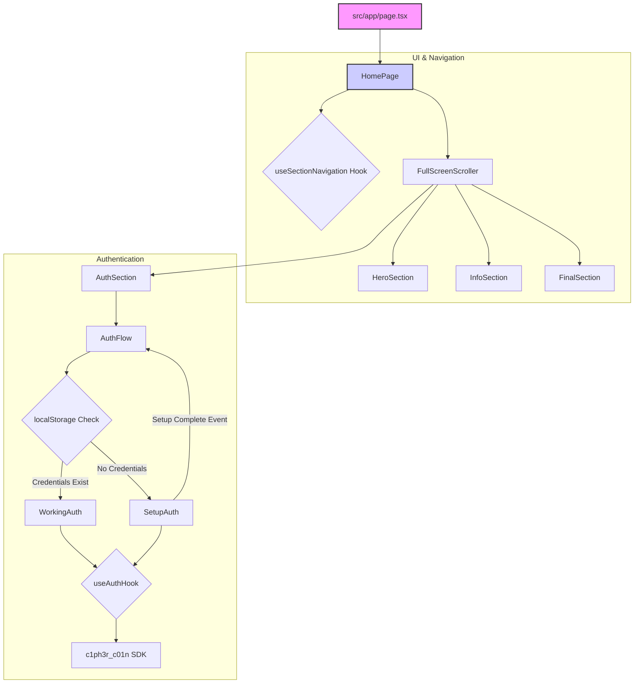
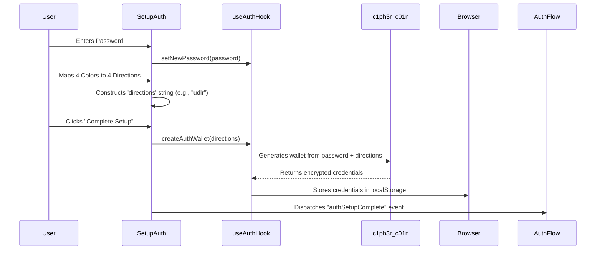
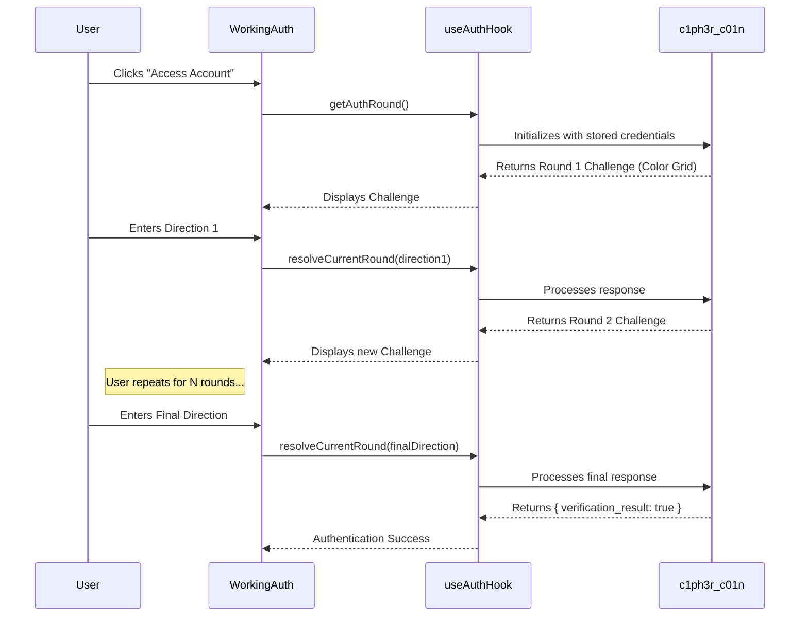

# Codebase Audit: Referral Dashboard

**Date:** 2025-06-23
**Auditor:** Cline, Senior Staff Engineer

## 1. Executive Summary

This document provides a comprehensive technical audit of the "referral-dashboard" repository. The application is a modern, single-page web application built with Next.js and features a unique, gamified, multi-factor authentication system. The codebase is well-structured, follows modern development practices, and is deployed in a secure, containerized environment on Google Cloud.

The primary areas for immediate improvement are the complete lack of an automated testing suite and the need for more detailed inline documentation, especially concerning the novel authentication mechanism.

---

## 2. Repository Mapping

The repository is well-organized, following conventions typical of a Next.js project.

### 2.1. File & Folder Structure

| Path | Purpose | Type |
| :--- | :--- | :--- |
| **`/`** | **Project Root** | - |
| `.env.example` | Environment variable template | Config |
| `.gitignore` | Git ignore rules | Config |
| `cloudbuild.yaml` | Google Cloud Build CI/CD pipeline | Config |
| `components.json` | Shadcn UI configuration | Config |
| `deploy.sh` | Deployment script (likely used by Cloud Build) | Script |
| `Dockerfile.dev` | Docker configuration for the application | Config |
| `next.config.ts` | Next.js framework configuration | Config |
| `package.json` | Node.js dependencies and scripts | Config |
| `README.md` | Project overview and setup | Docs |
| `tsconfig.json` | TypeScript configuration | Config |
| **`/public`** | **Static Assets** | Assets |
| `/public/icons` | PWA and favicon icons | Assets |
| **`/src`** | **Source Code** | Source |
| `/src/app` | Next.js App Router pages and layouts | Source |
| `/src/components` | Reusable React components | Source |
| `/src/constants` | Application-wide constants | Source |
| `/src/hooks` | Custom React hooks for shared logic | Source |
| `/src/lib` | Utility functions | Source |
| `/src/store` | Zustand state management stores | Source |

### 2.2. Generated vs. Handwritten Files

-   **Handwritten:** All files in `/src`, configuration files (`.ts`, `.js`, `.yaml`), `Dockerfile.dev`, and `README.md`.
-   **Generated:** `package-lock.json`, the `.next` directory (after build), and potentially `components.json` (managed by Shadcn UI CLI).

---

## 3. Architecture & Design

### 3.1. Overall Architecture

The application follows a **component-based, single-page application (SPA)** architecture built on Next.js with the App Router. The frontend is highly interactive and stateful, presenting a full-screen, section-based vertical scrolling experience.

### 3.2. Core Modules & Interactions

The application is primarily composed of three logical modules:

1.  **UI & Navigation Module:** Manages the overall page structure and the vertical scrolling experience.
2.  **Authentication Module:** Handles the entire user authentication flow, from setup to the challenge-response game.
3.  **State Management Module:** Provides global state using Zustand, though its usage appears minimal in the analyzed files.

### 3.3. Design Patterns

-   **Custom Hooks:** Logic is cleanly abstracted into hooks (`useSectionNavigation`, `useAuthHook`, `usePasswordValidation`), promoting reusability and separation of concerns.
-   **Component Composition:** The UI is built from small, focused components, as seen in the `HomePage` composing various sections.
-   **State Machine:** The `AuthFlow` and `SetupAuth` components act as simple state machines to manage the multi-step authentication process.
-   **Lazy Loading:** Performance is enhanced by lazy-loading heavy components (`AuthFlow`, `SetupAuth`, `WorkingAuth`) using `React.lazy` and `Suspense`.

---

## 4. Core Logic: The Authentication Flow

The application's most critical and unique feature is its two-part authentication mechanism.

### 4.1. Part 1: Setup (`SetupAuth.tsx`)

This flow onboards a new user by creating their secure credentials.

### 4.2. Part 2: Challenge-Response (`WorkingAuth.tsx`)

This flow authenticates a returning user.

---

## 5. Dependencies

### 5.1. Production Dependencies

| Library | Version | Purpose | Notes |
| :--- | :--- | :--- | :--- |
| **next** | `latest` | Full-stack React Framework | Core of the application. |
| **react** | `19.0.0` | UI Library | Using the latest version. |
| **@ducanh2912/next-pwa** | `^10.2.9` | Progressive Web App | Enables offline capabilities. |
| **tailwindcss** | `3.4.17` | CSS Framework | For utility-first styling. |
| **@radix-ui/** | `*` | Headless UI Primitives | Foundation for Shadcn UI. |
| **zustand** | `^5.0.3` | State Management | Lightweight global state. |
| **framer-motion** | `^12.2.0` | Animation Library | Powers the UI animations. |
| **ethers** | `^6.13.5` | Web3 Library | Ethereum interaction. |
| **fuels** | `^0.99.0` | Web3 Library | Fuel blockchain interaction. |
| **c1ph3r_c01n** | `^1.4.8` | **Core Auth SDK** | **Critical, custom auth logic.** |
| **resend** | `^4.1.2` | Email API | For sending transactional emails. |
| **zod** | `^3.24.2` | Schema Validation | Used with `react-hook-form`. |

### 5.2. Security & Versioning

-   The use of `next: "latest"` is risky for production builds as it can pull in breaking changes unexpectedly. It should be pinned to a specific version.
-   The `c1ph3r_c01n` library is a critical, potentially unaudited dependency. Its security and functionality are paramount to the application's integrity.

---

## 6. Configuration & Environment

-   **Build System:** The project uses `npm` for dependency management and `next build` for creating the production build.
-   **CI/CD:** A `cloudbuild.yaml` file defines a robust CI/CD pipeline on Google Cloud. It securely injects secrets from Google Secret Manager into a multi-stage Docker build, pushing the final image to Google Container Registry.
-   **Local Development:** The `dev` script (`next dev`) starts the local development server. The `"s"` script (`bun i && bun dev`) indicates that **Bun** is the preferred environment for local development.
-   **Environment Variables:** Secrets are managed via `.env` files. The `cloudbuild.yaml` process creates a `build.env` file from secrets, which is then used to create a `.env.production` file inside the Docker container.

---

## 7. Code Quality

-   **Style:** The code is clean, well-formatted (likely with Prettier), and consistently follows modern React/TypeScript conventions.
-   **Modularity:** High. Logic is effectively separated into components, hooks, and utilities.
-   **Documentation:** Low. While the code is readable, there is a lack of inline comments and JSDoc, especially for the complex authentication logic in `useAuthHook` and the `c1ph3r_c01n` interactions.
-   **Technical Debt:** Minimal visible debt in the analyzed files. The main debt is the lack of tests.

---

## 8. Testing

-   **Status:** **Non-existent.**
-   **Analysis:** There are no testing frameworks (`jest`, `vitest`, `testing-library`) listed in `package.json` and no test files (`*.test.ts`) visible in the repository.
-   **Recommendation:** This is the highest-priority area for improvement. A testing suite should be implemented immediately, starting with unit tests for the critical hooks (`useAuthHook`, `usePasswordValidation`) and component tests for the `SetupAuth` and `WorkingAuth` flows.

---

## 9. Security & Compliance

-   **Secret Management:** Excellent. Secrets are not checked into the repository and are securely injected at build time using a mature cloud service.
-   **Authentication:** The custom authentication protocol appears robust and is likely more secure than simple password-based systems. However, its security is entirely dependent on the implementation within the `c1ph3r_c01n` library.
-   **Potential Risks:**
    *   **Dependency Risk:** The `c1ph3r_c01n` library is a single point of failure and a potential security black box if not thoroughly audited.
    *   **Frontend Logic:** Since much of the auth logic (generating challenges, etc.) is in the frontend, it must be resilient to reverse-engineering. A zero-knowledge proof system would mitigate this, which is the likely implementation.

---

## 10. Opportunities for Improvement

1.  **Implement a Testing Strategy (Critical):**
    *   Introduce `vitest` and `@testing-library/react`.
    *   Write unit tests for all hooks.
    *   Write component tests for the `AuthFlow` and its children.
2.  **Add Inline Documentation (High Priority):**
    *   Document the `useAuthHook` and its interaction with the `c1ph3r_c01n` SDK in detail.
    *   Add JSDoc comments to all components and functions explaining their purpose, props, and return values.
3.  **Pin Dependency Versions (Medium Priority):**
    *   Change `next: "latest"` in `package.json` to a specific version (e.g., `next: "14.2.3"`) to ensure build stability.
4.  **Create Offline Fallback Page (Low Priority):**
    *   Create the `/offline` page referenced in `next.config.js` to improve the PWA experience.

---

## 11. Onboarding Checklist for New Contributors

-   [ ] **Understand the Core UI:** Read `src/components/home/home-page.tsx` and `src/hooks/use-section-navigation.ts` to understand the full-screen scrolling mechanism.
-   [ ] **Master the Auth Flow:** This is the most complex part of the app. Study the diagrams and code for `SetupAuth.tsx` and `WorkingAuth.tsx` thoroughly.
-   [ ] **Review the `useAuthHook`:** Read `src/hooks/use-auth-hook.ts` to understand how the frontend interfaces with the `c1ph3r_c01n` library.
-   [ ] **Set Up Local Environment:** Use `bun install` and `bun dev` to run the project locally.
-   [ ] **Ask for Secrets:** You will need access to the development secrets (or mock values) to run the authentication flow.
