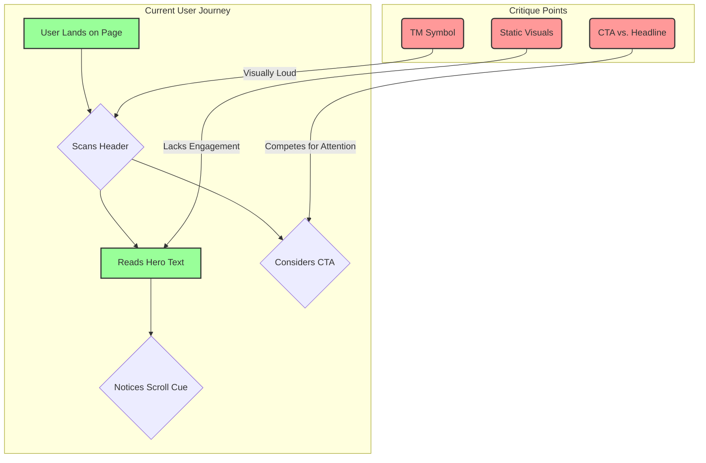

# UX/UI Audit: Pentagon Mobile Landing Page

**Date:** 2025-06-23
**Auditor:** Cline, Principal UX/UI Designer

---

## 1. Executive Summary & Overall Impression

This document provides a UX/UI audit of the mobile landing page for "Pentagon." The design presents a strong, minimalist, and professional aesthetic, effectively communicating a sense of high-tech security and seriousness. The core message is delivered with clarity and impact.

The primary areas for refinement are not in the core structure but in enhancing visual engagement, improving the call-to-action's (CTA) effectiveness, and ensuring the design elements are perfectly harmonized to guide the user's eye without competition. The foundation is solid, but there are clear opportunities to elevate the design from good to exceptional.

---

## 2. Design & Experience Analysis

### 2.1. Strengths (What Works Well)

*   **Minimalism & Focus:** The use of a black background and ample negative space is highly effective. It eliminates distractions and forces the user to focus on the central message. This is a confident design choice that aligns well with a security-focused brand.
*   **Strong Typography & Hierarchy:** The headline, "Authentication for the era of autonomy," is large, bold, and immediately commands attention. The smaller, lighter-weight sub-headline, "secret keys that are never exposed," plays its supporting role perfectly. This creates a clear and effective visual hierarchy.
*   **Clear Scroll Affordance:** The downward-pointing chevron is a universally understood symbol for "scroll down." It's subtle enough not to be distracting but clear enough to guide the user to the next section.
*   **Professional Tone:** The overall aesthetic feels modern, clean, and authoritative. It builds trust and credibility from the first glance.

### 2.2. Areas for Improvement & Rationale

*   **Call to Action (CTA) Design:**
    *   **Critique:** The primary CTA, "Explore the research," is presented as a solid white button. While clear, its high visual weight creates direct competition with the main headline. The user's eye is drawn to two primary elements simultaneously, which can dilute the impact of the core message.
    *   **Rationale:** The goal of a hero section is to deliver the value proposition first, then guide the user to an action. When the CTA is as loud as the headline, this flow is disrupted.

*   **Visual Engagement:**
    *   **Critique:** The page is entirely static. While minimalism is a strength, a complete lack of motion or subtle visual interest can make the experience feel flat.
    *   **Rationale:** A subtle, non-intrusive animation (e.g., a slow background gradient shift, a geometric pattern animation, or a "breathing" effect on the scroll cue) can significantly increase perceived quality and user engagement without adding clutter.

*   **Brand Element Refinement (Logo & TM):**
    *   **Critique:** The "TM" trademark symbol next to "Pentagon" is disproportionately large and close to the logotype. It feels like a legal requirement that has been implemented without sufficient design consideration.
    *   **Rationale:** Small details matter. A smaller, more gracefully placed TM symbol would make the logo feel more polished and professionally executed.

*   **Sub-headline Casing:**
    *   **Critique:** The sub-headline is in sentence case. This is perfectly acceptable, but an alternative could be stronger.
    *   **Rationale:** Using all-lowercase for the sub-headline ("secret keys that are never exposed.") would create a more intentional, stylistic contrast with the title-cased headline, enhancing the design's modern feel.

---

## 3. Actionable Recommendations

1.  **Modify the CTA Button (High Priority):**
    *   **Action:** Change the CTA from a solid fill to a "ghost button" style (a button with a white outline and transparent background).
    *   **Effect:** This will reduce its visual weight, allowing the main headline to be the undisputed focal point. The CTA remains clear and actionable but no longer competes for primary attention. The text inside could also be slightly smaller.

2.  **Refine the Logo's TM Symbol (Medium Priority):**
    *   **Action:** Significantly reduce the size of the "TM" symbol and adjust its vertical alignment to be superscript, positioned neatly at the top-right of the "n" in "Pentagon."
    *   **Effect:** This is a small but critical refinement that signals a high level of polish and attention to detail.

3.  **Introduce Subtle Animation (Medium Priority):**
    *   **Action:** Consider adding a very slow, subtle animation. For example, a faint geometric pattern in the background that slowly fades in and out, or a gentle "pulse" animation on the scroll-down chevron.
    *   **Effect:** This will make the page feel more dynamic and premium, increasing user engagement without being distracting.

4.  **Experiment with Sub-headline Casing (Low Priority):**
    *   **Action:** Test an all-lowercase version of the sub-headline.
    *   **Effect:** This is a stylistic choice that can enhance the modern, minimalist aesthetic. It's a low-effort change that could have a positive impact on the overall design harmony.

---

## 4. Conclusion

The current design is strong and effective in its core mission. By implementing the recommendations above—particularly the CTA modification—the page can be elevated from a good, functional design to a truly exceptional and memorable user experience that perfectly balances clarity, authority, and modern sophistication.
